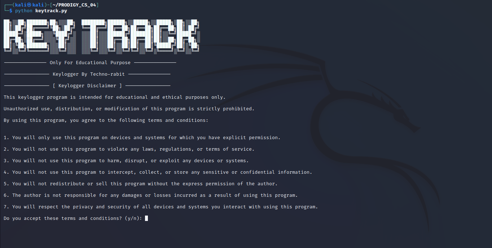

# PRODIGY_CS_04

<p align="center">
<a href="#"></a>
</p>
<p align="center">
<a href="https://github.com/vxnuprasad"></a>
<a href="https://prodigyinfotech.dev/"></a>
</p>
<p align='center'
<a href="https://github.com/techno-rabit"></a>
</p>

# KEY TRACK ( Simple Keylogger )

This Python-based keylogger captures and logs keystrokes for a specified duration, saving them to a file with a timestamp. It includes an ethical disclaimer, ensuring users understand the responsible use of the tool.

## Features

- **Keystroke Logging**: Records all keys pressed and stores them in a log file.
- **Timestamp**: Each keystroke is logged with a timestamp for detailed tracking.
- **User Prompt**: Asks for the duration of logging and ensures acceptance of the disclaimer.
- **Ethical Usage**: Only runs after user agreement to terms of responsible and ethical usage.

## How It Works
### 1. Duration Input: Prompts the user to specify how long the logging should run.
### 2. Logging: Captures and logs key presses to a text file with timestamps.
### 3. Log File: Provides the path of the saved log file at the end of execution.

## Usage

To use the keylogger, run the script, accept the disclaimer, and input the desired logging duration.

### Requirements

Ensure you have the `pynput`, `time`, and `os` libraries available in your Python environment.

Install `pynput`
```sh
pip install pynput
```
Install `time`
```sh
pip install TIME-python
```
Clone the GitHub Repository:
```sh
git clone https://github.com/vxnuprasad/PRODIGY_CS_04
```
Run:
```sh
python keytrack.py
```

## Contributions

If you find this tool useful, consider following [vxnuprasad](https://github.com/vxnuprasad) on GitHub!

## Find Me on:

[](https://www.linkedin.com/in/vxnuprasad)
[](https://www.instagram.com/__.v.shnu/)
